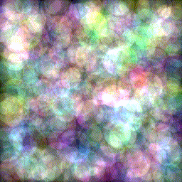
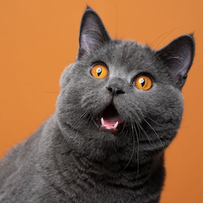
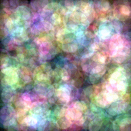
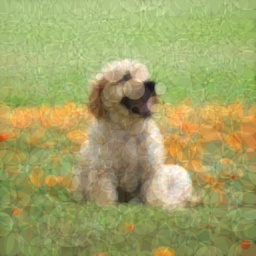
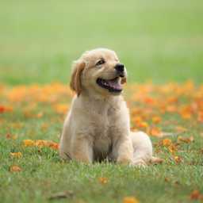
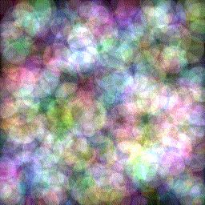
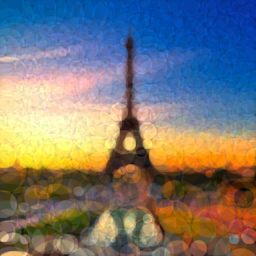
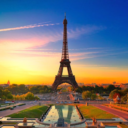

# Drast
(https://crates.io/crates/drast)


A fast, differentiable 2D rasterizer written in Rust that optimizes circle parameters to match a target image. Enables gradient-based shape optimization with support for animation output and resolution independent rendering.

Traditional rasterizers draw shapes by splitting them into triangles and rendering those using highly optimized triangle rasterization algorithms such as [scanline](https://en.wikipedia.org/wiki/Scanline_rendering) or [barycentric](https://en.wikipedia.org/wiki/Barycentric_coordinate_system). Unfortunately, the discrete operations used by these algorithms break differentiability and make it impossible to backpropagate a loss given a target value. Drast instead renders shapes in a fully differentiable manner using solely functions which are continuous and well defined throughout their entire domain.

---
## Demos
<table>
	<tr>
		<td align="center"><strong>Optimization Process</strong></td>
		<td align="center"><strong>Fully Converged</strong></td>
  	<td align="center"><strong>Target Image</strong></td>
	</tr>
	<tr>
		<td align="center"></td>
		<td align="center"></td>
		<td align="center"></td>
	</tr>
	<tr>
		<td align="center"></td>
		<td align="center"></td>
		<td align="center"></td>
	</tr>
	<tr>
		<td align="center"></td>
		<td align="center"></td>
		<td align="center"></td>
	</tr>
</table>

## How it works

### Initialization
The [optimization](https://en.wikipedia.org/wiki/Mathematical_optimization) process begins by initializing the parameters, position, size, and color, of a set of circles using some random probability distribution. A [uniform distribution](https://en.wikipedia.org/wiki/Continuous_uniform_distribution) was used for the position and size to ensure an even spread throughout the canvas, though more testing is required to determine whether this is the best choice.

### Rasterization
To rasterize a circle differentiably, we loop through each pixel on the canvas and compute the [euclidean distance](https://en.wikipedia.org/wiki/Euclidean_distance) from that pixel to the center of the circle. Depending on whether the computed distance is greater than the radius, we can use that to determine whether the pixel is inside the circle. However, doing this process using branching would break [differentiability](https://en.wikipedia.org/wiki/Differentiable_function). For this reason, we instead pass the distance through a parametrized sigmoid function which stretches values towards either 0 or 1 along the edge of the circle. This ensures a smoother rasterization with tunable antialiasing while preserving differentiability.

### Backpropagation
Finally, after summing the outputs of each circle on the raster image, we compute the [L2 loss](https://en.wikipedia.org/wiki/Mean_squared_error) which is given to us using the equation `(output - target)²`. To minimize this loss, we must calculate its partial derivative function with respect to each parameter. We use this function to compute the gradients (or slope) for each parameter and average them out before subtracting them from their respective parameters. This essentially *moves* each circle in a way that minimizes the global loss.

### AABB Optimization
The derivative of the [sigmoid](https://en.wikipedia.org/wiki/Sigmoid_function) activation function approaches zero as x tends towards negative and positive infinity. This results in many of the gradients computed on the canvas to contribute *very* little to the overall movement of the circle. We can optimize the gradient computation by only considering points within the circle by only running the rasterization and backpropagation processes inside the bounding box of the circle. This speeds up the gradient descent process *drastically*.

## Install

You can install the binary directly using `cargo install`:
```
cargo install --git https://github.com/fqhd/drast
```

## Build from Source
1. **Clone the repository:**
```
git clone https://github.com/fqhd/drast.git
cd drast
```

2. **Build the project**
- For a developer build:
```
cargo build
```

- For a release build:
```
cargo build --release
```

## Usage
To use drast, simply run the `drast` binary and specify a target image as a compiler argument
```
drast images/cat/target.png --verbose --width 256
```
**or:**
```
cargo run -- images/cat/target.png --verbose --width 256
```
The final rasterized image will be saved under `raster.png` by default. You can specify a different filename using the `--output` argument.

For a list of arguments that can be passed in to the binary, run:
```
drast --help
```
**or:**
```
cargo run -- --help
```

### GIF Animation
If you want to visualize the optimization process, passing in `--save_frames` will tell drast to rasterize the geometry after each gradient descent step and save the image inside the `frames` directory.

The frames will be saved with their index as part of their name, e.g `frame000.png`. This naming convention makes it easy to use tools such as `ffmpeg` or write your own script to compile these images into a gif or video.

```
ffmpeg -framerate 20 -i frames/frame%03d.png -loop 0 animation.gif
```

## Todo
- SVG support
- GPU Acceleration
- Multiple shapes
- Better Parameter Initialization
- Convergence Metric
